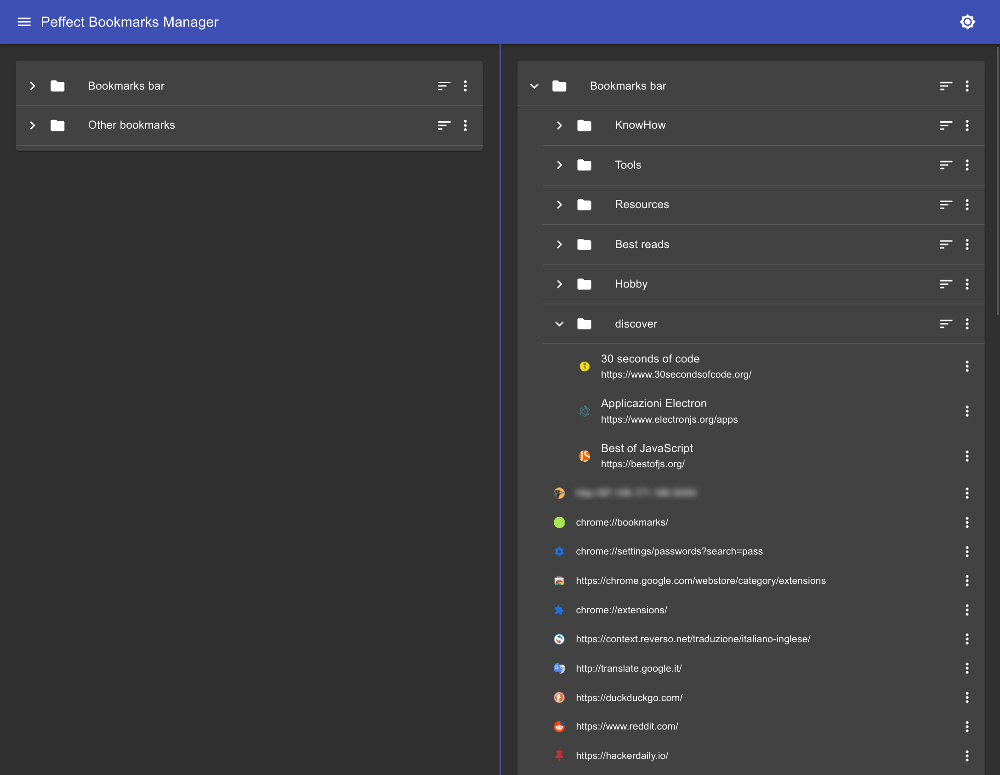

# Peffect Bookmarks Manager

Peffect Bookmarks Manager is an extension, written in Typescript and React, for the Google Chrome browser that aims to improve and simplify the bookmarks management inside the browser through a multi-column UI, drag-and-drop and more advanced operations. 

If you are like me, with thousands of bookmarks collected during many years on the internet, you will love it.

Once installed it will replace the default Chrome bookmarks manager available at `chrome://bookmarks/`.



## Features

- Simple UX, minimal UI
- Dark theme (I was tired of losing my eyes while organizing my bookmarks at 01:00 A.M.)
- UI organized in two column, each one with it's own navigation, that allows us to navigate different folders at the same time and to have a comprehensive vision of the bookmarks.
- Drag-and-drop: the most simple way to manage your bookmarks. Just select a bookmark from the left column and move it into a folder of the right column.
- Some advanced operations suchs as `Sort children` that allows to sort all the bookmarks inside a folder in alphabetical ascending order but keeping the folders at the top of the list, as it happens with the file explorer we use everyday. This actually changes the order of the bookmarks saved in your browser. There is also a **recursive** version of this feature.

## How to install and use it

The application is too unstable to have a released version. If you want to give it a try you can clone this repository and build the project, here is the commands to run:

```bash
  git clone https://github.com/a-chris/peffect-bookmarks-manager.git
  cd peffect-bookmarks-manager
  npm install
  npm run build
```

then

1. go to `chrome://extensions/`
2. click **Load unpacked**
3. select the `dist` folder of this project
4. the app is now available at `chrome://bookmarks/`, if you can't see it then try to reload the page.

## TODO

- [ ] Find a nice icon
- [ ] Fix most of the performance issues. The other planned features depend on this.
- [ ] Allow drag-and-drop for both bookmarks and folders to from the left column to the right column and viceversa. At the moment we can only **drag** a bookmark from the **left column** and **drop** to the **right column** and we can't move folders due to the number of Droppable and Draggable components which would really degrade performance.
- [ ] Batch operations: each bookmark of the list should have a checkbox to select/unselect it and then we can execute CRUD operation on the selected bookmarks at the same time. This feature is a must but I need to work on the performance issues before to work on this.
- [ ] Implements the extension popup
- [ ] Write tests for the Redux logics

## Known issues

### Performance

Opening multiple heavy nested bookmarks folders make the application unusable. This is much worse during the development and while using Linux machines (due to the missing hardware accelleration on my computer, I think)

### Hard to debug

Redux and React DevTools do not work while running this application in form of a browser extension, a workaround I found is to run it as a React application and debug it at `http://localhost:5000/dev_bookmarks.html`.
This approach works but it's not possible to modify any data or bookmarks because it uses mocked data.

## Technical details

### Drang-and-drop library

I started the project by using `react-dnd` library, which is the de-facto standard, but the application were unusable even with a few of bookmarks and folders for each column, so I tried `dnd-kit` and I felt like it is much faster and more customizable, of course it is not perfect yet.

## Contribute

Feel free to fill an issue to report bugs or give advices to improve the application. I hope you guys like this project and want to help me, I would love to receive pull requests and see this project grow.

## Development

### Working with the Chrome extension

To work with this project in form of Chrome extension you need to run the `dev-watch` script:

```bash
  npm run dev-script
```

then import the unpacked Chrome extension as I've explained in the **How to install and use it** section. You can start editing the code and every time you save it will compile a new version then you have to reload the page to see the changes.
The app in development mode is much slower than the one in production mode.

### Working with the React application

This is just a workaround to use the React and Redux DevTools, mostly to debug the drag-and-drop, so you can't execute operation on the bookmarks for real because the bookmarks you can see are statically loaded from `mock/nodes.json`.

Run:

```bash
  npm run dev-script
  npm run serve
```

and go to `http://localhost:5000/dev_bookmarks.html` to see the app.


### Changelogs

Changelog file available [here](https://github.com/a-chris/peffect-bookmarks-manager/blob/main/CHANGELOG.md)